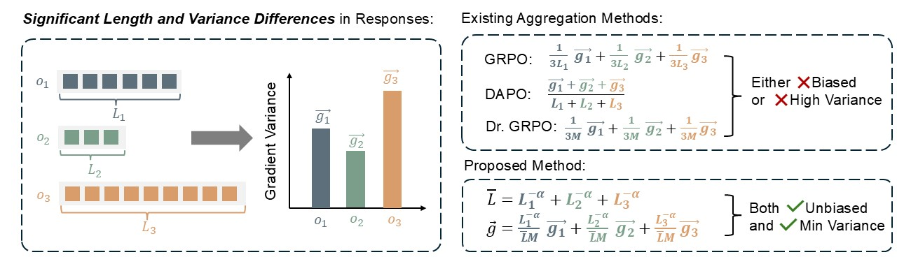

# ∆L Normalization: Rethink Loss Aggregation in RLVR

We propose ***∆L Normalization***, a simple yet effective loss aggregation method tailored to the characteristic of ***dynamic generation lengths*** in RLVR.

<p align="center">
  
</p>

We find existing aggregation methods in RLVR either produce biased estimates or still suffer from high gradient variance. Our proposed ***∆L Normalization*** not only provides an unbiased estimate of the true policy loss but also minimizes gradient variance in theory. Thus it enables more stable training and higher converged accuracy.

## Setup

First, clone the repository:

```bash
git clone https://github.com/zerolllin/Delta-L-Normalization.git
```

Then, set up the environment with the provided script:

```bash
cd Delta-L-Normalization
bash -i setup.sh
``` 

This script will:
- Create two `conda` environments:  
  - **`verl`** for main training scripts  
  - **`verl_server`** for LaTeX verification server  
- Compile FlashAttention from scratch.
  - We recommend keeping this step, since an improperly installed FlashAttention may cause `verl` to hang.  
  - If you are confident that it is unnecessary for you, remove the corresponding lines in `setup.sh`.

All scripts require the environment variable `$WANDB_API_KEY` to connect to Weights & Biases. Be sure to set it before running:


```bash
export WANDB_API_KEY=XXXXX
```

For math tasks, training scripts rely on a LaTeX checking server to verify equivalence of expressions. Start the server and keep it running with:

```bash
conda activate verl_server
cd Delta-L-Normalization/server/math
python server.py
``` 

## ∆L Normalization with DAPO

These training scripts provide reproduction of the experiments that use ∆L Normalization with DAPO. Use the following way to start them:

```bash
conda activate verl
export WANDB_API_KEY=XXXXX
cd Delta-L-Normalization/recipe/dapo
bash <yyyy>.sh
```

| Task      | Script                                                                 | Comment                                                                 |
|-----------|-------------------------------------------------------------------------|-------------------------------------------------------------------------|
| CountDown | [countdown-dapo-3b-w-overlong-filtering.sh](recipe/dapo/countdown-dapo-3b-w-overlong-filtering.sh) | Full DAPO with overlong filtering                                       |
| CountDown | [countdown-dapo-3b-w-soft-punishment.sh](recipe/dapo/countdown-dapo-3b-w-soft-punishment.sh)       | Full DAPO with soft punishment                                          |
| CountDown | [countdown-dapo-3b-wo-sp-wo-of.sh](recipe/dapo/countdown-dapo-3b-wo-sp-wo-of.sh)                   | Full DAPO without soft punishment and without overlong filtering        |
| CountDown      | [countdown-dapo-3b-delta-L-norm-alpha-1.sh](recipe/dapo/countdown-dapo-3b-delta-L-norm-alpha-1.sh)      | Full DAPO with ∆L Normalization, and $\alpha$ is set to 1. Soft punishment and overlong filtering are not used. |
| math      | [math-dapo-3b-w-overlong-filtering.sh](recipe/dapo/countdown-dapo-3b-w-overlong-filtering.sh)      | Full DAPO with overlong filtering                                       |
| math      | [math-dapo-3b-w-soft-punishment.sh](recipe/dapo/countdown-dapo-3b-w-soft-punishment.sh)            | Full DAPO with soft punishment                                          |
| math      | [math-dapo-3b-wo-sp-wo-of.sh](recipe/dapo/countdown-dapo-3b-wo-sp-wo-of.sh)                        | Full DAPO without soft punishment and without overlong filtering        |
| math      | [math-dapo-3b-delta-L-norm-alpha-0.75.sh](recipe/dapo/math-dapo-3b-delta-L-norm-alpha-0.75.sh)     | Full DAPO with ∆L Normalization, and $\alpha$ is set to 0.75. Soft punishment and overlong filtering are not used. |


In the scripts, the `N_GPUS` parameter may be set to either 4 or 8, reflecting the configuration used to produce the raw results reported in the paper. The choice should have little impact on final performance, but we recommend using 8 GPUs whenever possible to speed up training.

## Experiments with ∆L Normalization Only

These training scripts provide reproduction of the experiments that compare ∆L Normalization with other loss aggregation methods. Use the following way to start them:

```bash
conda activate verl
export WANDB_API_KEY=XXXXX
cd Delta-L-Normalization/train_scripts
bash <yyyy>.sh
```

| Task      | Method                          | Script                                                                 |
|-----------|---------------------------------|------------------------------------------------------------------------|
| CountDown | DAPO Norm                       | [countdown-3b-dapo-norm.sh](train_scripts/countdown-3b-dapo-norm.sh)   |
| CountDown | GRPO Norm                       | [countdown-3b-grpo-norm.sh](train_scripts/countdown-3b-grpo-norm.sh)   |
| CountDown | Dr. GRPO Norm                   | [countdown-3b-dr-grpo-norm.sh](train_scripts/countdown-3b-dr-grpo-norm.sh) |
| CountDown | Dr. GRPO                        | [countdown-3b-dr-grpo.sh](train_scripts/countdown-3b-dr-grpo.sh)       |
| CountDown | ∆L Normalization w/ $\alpha=1$ | [countdown-3b-delta-l-norm-alpha-1.sh](train_scripts/countdown-3b-delta-l-norm-alpha-1.sh) |
| Math      | DAPO Norm                       | [math-3b-dapo-norm.sh](train_scripts/math-3b-dapo-norm.sh)             |
| Math      | GRPO Norm                       | [math-3b-grpo-norm.sh](train_scripts/math-3b-grpo-norm.sh)             |
| Math      | Dr. GRPO Norm                   | [math-3b-dr-grpo-norm.sh](train_scripts/math-3b-dr-grpo-norm.sh)       |
| Math      | Dr. GRPO                        | [math-3b-dr-grpo.sh](train_scripts/math-3b-dr-grpo.sh)                 |
| Math      | ∆L Normalization w/ $\alpha=0.75$ | [math-3b-delta-l-norm-alpha-0.75.sh](train_scripts/math-3b-delta-l-norm-alpha-0.75.sh) |


## Implementation of ∆L Normalization

The main logic is in `verl/trainer/ppo/core_algos.py`:

```python
# in verl/trainer/ppo/core_algos.py, function `compute_grpo_outcome_advantage`

if use_grpopp:
    valid_length_list = response_mask.sum(dim=1).detach().cpu().numpy().tolist()
    mean_length = float(np.mean(valid_length_list))
    length_reciprocal_list = []
    for length in valid_length_list:
        length_reciprocal_list.append(
            1 / ((length / mean_length) ** grpopp_config["alpha"])
        )
    length_reciprocal_mean = float(np.mean(length_reciprocal_list))
    for i in range(bsz):
        scores[i] = scores[i] * (length_reciprocal_list[i] / length_reciprocal_mean)

# in verl/trainer/ppo/core_algos.py, function `compute_policy_loss`

 if use_grpopp:
    pg_loss = verl_F.masked_mean_allavg(pg_losses, response_mask)
```

There are two small differences compared to the description in the paper:

1. We use `mean_length` as the common divisor to maintain stable numerical precision.  
2. We compute `length_reciprocal_list[i] / length_reciprocal_***mean***` instead of  
   `length_reciprocal_list[i] / length_reciprocal_***sum***`, since the sample axis is  
   normalized later in `verl_F.masked_mean_allavg`.

Overall, the implementation remains mathematically equivalent to what is described in the paper.

## Acknowledgement

This project incorporates code from [verl](https://github.com/volcengine/verl), [Open Reasoner Zero](https://github.com/Open-Reasoner-Zero/Open-Reasoner-Zero), and [TinyZero](https://github.com/Jiayi-Pan/TinyZero). We deeply appreciate the contributions of the original authors.


